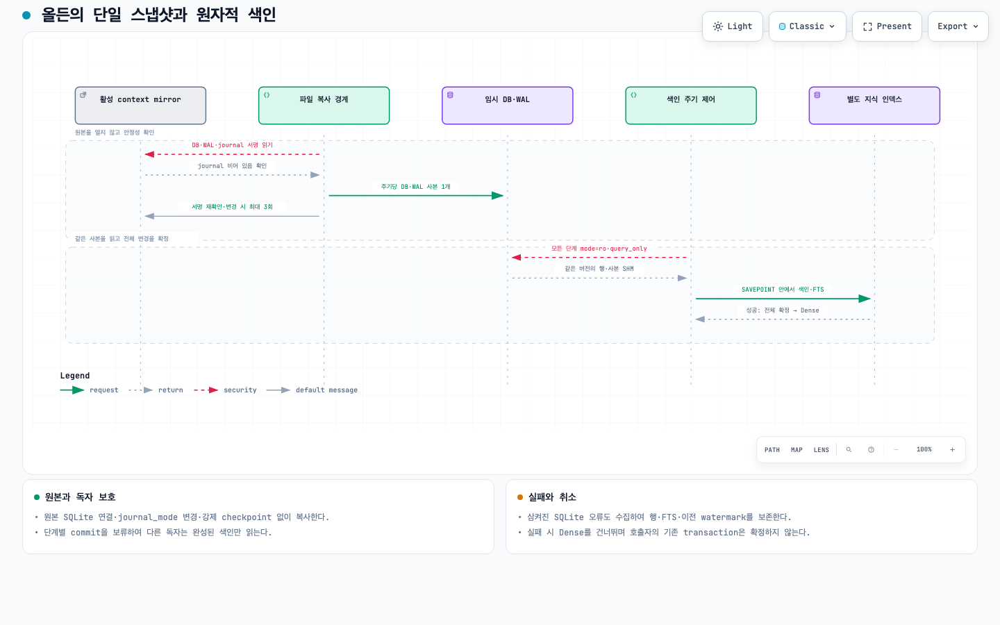

# 단일 스냅샷과 원자적 GraphRAG 갱신

전체 Alden 목표는 진행 중이다. 이번 변경은 source code `1a728e8`의 색인 주기, 설치 helper와 로컬 산출물을 다룬다. 원문 목표 ba814151의 11개 항목을 다시 읽고 기존 범위를 유지했다.

단계마다 원본 mirror를 다시 복사하여 서로 다른 WAL 버전을 읽었고, 내부에서 삼킨 SQLite 실패 뒤에도 일부 행 삭제·FTS 변경·최신 watermark가 확정됐다. 새 주기는 private DB+WAL 사본 하나를 모든 읽기 단계에 공유한다. 내부 단계의 commit을 보류하고 SQLite SAVEPOINT로 전체 변경을 확정한다. 복사·연결·SQL 실패와 취소는 이전 행·FTS·watermark를 보존하고 Dense를 건너뛴다. 호출자의 기존 transaction은 임의로 commit하지 않는다.

| 측정 범위 | 기준선 | 수정판 | 해석 |
| --- | ---: | ---: | --- |
| 고정된 실제 mirror 색인 시간 중앙값, 각 n=5 | 5.383초 | 3.390초 | 관측 감소율 37.04% |
| 해당 5개 표본의 최솟값–최댓값 | 4.421–5.576초 | 3.013–3.910초 | p95를 보고하지 않음 |
| source snapshot 복제 호출 | 5회 | 1회 | 모든 단계가 같은 사본 사용 |
| 프로세스 최대 RSS 중앙값 | 102,187,008 bytes | 102,285,312 bytes | 메모리 감소는 관측되지 않음 |
| 정렬된 전체 색인 결과 | 엔티티56·관계384·FTS56 | 동일 | 10/10 SHA-256 일치 |

[측정 JSON](alden-graph-cycle-benchmark-20261001.json)은 실제 private mirror 1,400,426,496 bytes와 네 ledger, 동일 초기 graph/dense를 사용한 교대 실행 5쌍을 기록한다. 이 비교의 Dense 단계는 stub이며 모델 호출·전송·생산 쓰기0이다. 공유 장치의 다른 부하는 통제하지 못했으므로 일반적인 제품 속도나 전력 개선을 주장하지 않는다. 호출자 transaction 처리의 마지막 수정은 비교 이후에 추가됐고, 최종 source의 별도 1회 출력 해시 대조로 정상 경로 결과 일치를 확인했다. 원시 대화와 임시 실데이터는 저장소에 넣지 않았으며 측정 후 소유한 private 복제본만 삭제했다.

[필수 검사 기록](alden-graph-cycle-source-verification-20261001.json): CPython3.11.9, CI의 62개 선택자, 981개/16 skip/실패0, 118.496초. 새 주기 회귀10개는 WAL 변경 중 같은 버전 읽기, 실패 시 부분 행·FTS rollback, 독자의 중간 변경 비노출, 취소와 연결 실패, 호출자 transaction 보존을 다룬다. Astra/max 독립 검토의 연결-open P2를 실제 fake probe로 확인하고 수정했다. 실제 전송을 시험하지 않았다.

[설치 기록](alden-graph-cycle-install-20261001.json): Alden0.1.6, build/install29개 파일·26개 resource 바이트 일치, LaunchAgent PID92542의 정확한 실행 파일과 strict/deep ad-hoc signature 확인. 기존 installer가 이전 앱과 plist를 보존했다. 전용 graph lock 아래 두 저장소를 백업하고 설치 CPython3.11.16/helper와 실제 로컬 E5로 1회 갱신했다. 3.335초, graph/dense quick_check=ok, watermark1790782429 일치, error없음. 이 수치를 기준선 비교나 지속 최신성·검색 품질로 취급하지 않는다. enrollment와 queue 파일5개 식별자 보존, 기존 backend3/3ready. 다른 세션 worker 교체·프로브 전송0이다.

[현재 시퀀스](alden-python-snapshot.html)는 단일 사본과 전체 확정·실패 흐름을 반영한다. [Archify receipt](alden-python-snapshot-delivery-20261001.json)는 showcase9/9·오류/경고0, 네 desktop 크기 containment와 light/dark 네 캡처를 별도로 기록한다. 부모가 실제 네 이미지를 판독했다. 한국어 authored content를 유지하며 고정 Viewer UI와 HTML lang은 English fallback이다. 이는 설치 앱 화면의 검증이 아니다.

로컬 ZIP·offline CPython·manifest·checksums는 `dist/alden-0.1.6-local`에 있다. 최종 전달 SHA와 원격 CI readback은 그 폴더의 `alden-delivery-readback-v1.json`으로 대조한다. [새 worker 후보](alden-graph-cycle-worker-candidate-20261001.json)도 private state에 준비해 20/20 assets·18/18 source·기존3selectors/config 일치를 확인했고 shared stable CLI의 inode/mtime/hash를 보존했다. 활성화하지 않았으며 권한이 오면 실제 state를 보존하여 재준비한다. PR#27은 draft다. 공개 서명/공증 credentials, 다른 세션 worker 교체 권한, native 창·물리 비상 중단·사람 음성, 실제 pixel/file-content 처리와 제품 전체 성능 검증은 남아 있다.
