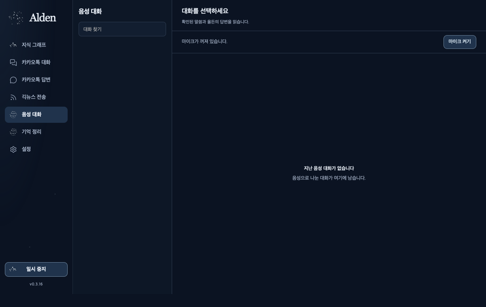

# Alden 0.3.16 — explicit microphone input

The installed voice page now provides **마이크 켜기 / 마이크 끄기** without requiring an unreleased automatic wake model. The previous UI disabled every microphone start and the native command always returned `alden_wake_model_unavailable`; that prevented actual voice use and testing. Manual activation is a separate explicit action. The automatic wake command and its release gate remain closed, with no invented wake score or substituted stock phrase.

The screenshot is an owned WKWebView using the installed app and actual read-only sources. Its start/stop commands are unregistered by the audit policy. It proves rendering and the visible manual control, not physical microphone activation or primary interaction.

## Input and context

A native start checks the global pause, exact runtime/resource paths and existing voice processes before creating one owned child. It opens the microphone only after the user requests it and handles OS permission at that point. VAD runs on 16 kHz, mono PCM16 frames. STT, the fixed local 27B LLM and Qwen3-TTS remain lazy; silence does not repeatedly run inference. No model defaults or existing model/voice/automation process was replaced.

The selected local voice conversation is passed by its exact ID. Only its confirmed user/assistant records are restored, with existing turn/context counters; another conversation is not merged. Restarting the microphone can therefore preserve the selected history. Unknown conversations fail with a context error before microphone startup. New conversations receive new IDs.

Manual capture preserves the onset and pauses instead of concatenating only VAD-positive audio. With frame duration `320 / 16,000 = 0.02 s`:

| Parameter | Rule | Meaning |
| --- | --- | --- |
| Pre-roll | `10 × 0.02 = 0.2 s` | Retain audio immediately before detected speech |
| End silence | `30 × 0.02 = 0.6 s` | Finalize a spoken utterance after a pause |
| No-speech timeout | `750 × 0.02 = 15 s` | Close an idle microphone without generating a reply |
| Audio bound | `12 × 16,000 × 2 = 384,000 bytes` | Includes onset, speech and retained silence |

Buffer overflow returns a short-input request rather than silently discarding the start of a sentence. The legacy wake path still uses its existing 12-frame end threshold. These are parameters and controlled behavior checks, not measured natural end-to-playback latency or proof that 0.6 seconds is optimal.

The existing echo processing, playback input suppression, barge-in, role/event separation, turn cancellation and late-result rejection are retained. A completed reply rearms manual listening in the same conversation. A user stop cancels only the owned child, gives cooperative cleanup up to two seconds, then bounds an unresponsive child. The native session has a five-minute deadline. Parent-process exit also cancels the mic loop; closing a window while the app remains alive is distinct from exiting the app. Global emergency stop stays latched until explicit resume.

## Verification and delivery scope

Controlled voice checks: **55 total, 5 skipped**; all executed cases passed. Tests cover two-turn context, selected-context restoration after a new mic session, no mixing of conversations, onset/pause retention, buffer overflow, silence and self-output exclusion, cancellation and parent exit. Desktop Rust **98/98** includes owned-child graceful stop, an unrelated child left alive and bounded termination of an uncooperative child. UI **257/257** passed before final small changes; final affected cases **98/98**, TypeScript/Vite and clippy pass.

Installed 0.3.16 has exactly **41** built/installed files matched by SHA-256 and a valid deep/strict ad-hoc signature. Three configuration/CLI baselines, three model preference files and five existing model, embedding, voice and automation process identities stayed unchanged. The actual voice runtime is the existing isolated CPython **3.11.9**; its required packages were found without changing that environment.

Owned native render audit: **7 default + 7 compact pages**, zero page errors and zero horizontal overflow. First-frame observations span 14 heterogeneous navigations; their p95/max are recorded in [the aggregate JSON](alden-manual-voice-20261004.json). This is not a before/after latency improvement or physical primary/Retina/OS-lock attestation.

[The Archify lifecycle](alden-manual-voice-20261004.v3.html) reflects the direct-input path and retained automatic-wake gate. Its showcase artifact checks and four-size browser measurements passed; the 1440×900 light capture was visually inspected. Authored copy is Korean; fixed viewer controls remain English. Earlier candidates with viewport overflow were privately archived rather than presented as final evidence.

The in-app browser preview gives a clear installed-app instruction instead of pretending to record. Its footer still reflects the older development-server startup version, so its screenshot is not installation evidence. Computer Use access to the updated native app timed out again. The natural microphone test question was sent before discovering the old wake-only start gate and was explicitly corrected; physical voice input remains pending. No natural-voice accuracy or latency gain is claimed.

The full goal remains active. Automatic wake release, natural/primary validation, actual Alden-dot invocation, unmet model/media targets and Developer ID/notary production remain separate from this manual-input delivery.
