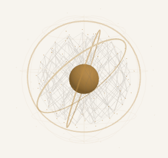
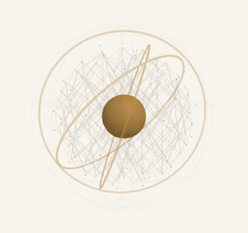

# Alden 설치 바이너리의 네이티브 코어와 숨김·복원 검증

네이티브 전달 링크: [Alden 0.1.6 로컬 후보 초안 릴리즈](https://github.com/twoimo/openkakao-bot/releases/tag/untagged-179cb6167afd74a68bd5). 앱 ZIP·Python 동반 실행 환경·소스/증거·체크섬 **7개 산출물**을 다운로드하여 원본과 바이트 일치를 확인했다. 증거 커밋 `60fdb04`의 [CI](https://github.com/twoimo/openkakao-bot/actions/runs/36790224085)도 **4/4 성공**이다. [전달 readback](alden-native-render-release-20261001.json)에 소스·설치·릴리즈의 범위를 대조했으며 공개 공증/프로덕션 완료를 뜻하지 않는다.


소스 `4838fffc9323e499fd734178b1b42b606dbc7514`를 빌드하여 Alden 0.1.6에 설치했다. **설치 파일 30/30, 리소스 27/27**이 빌드·소스와 일치하고 ad-hoc 서명 검사가 통과했다. 기존 번들 30개 파일과 LaunchAgent 설정을 먼저 백업하고 바이트 일치를 확인했다. 정상 LaunchAgent는 PID 39125이며 공유 MLX PID 3273과 기존 카카오톡 작업 PID 87952/87955/88035를 유지했다.

**상태: 구현·실제 실행 검증·로컬 설치·코드 전달 완료.** `/Applications/Alden.app`의 실제 실행 파일로 별도 검증 인스턴스 PID 39541을 실행했다. WebKit `takeSnapshot`으로 실제 Three 코어가 담긴 PNG를 캡처하고 직접 이미지를 확인했다. 브라우저의 Tauri 모형이나 합성 업무 부하를 사용하지 않았다. 검증 인스턴스는 PythonBridge·생산 명령·트레이·전역 단축키를 등록하지 않아 코어는 실제 작업 입력 없는 idle 상태다. 네트워크를 거부하는 macOS sandbox 정책 안에서 실행했다.

| 측정 | 설치 바이너리의 별도 인스턴스 결과 |
|---|---|
| 실제 화면 | 276×260 CSS px, 236×236 코어, DPR 1, 스크롤·잘림·WebGL context loss 없음 |
| 실제 숨김·복원 | 10회, 각 숨김 350ms 동안 추가 렌더 호출 **0** |
| 복원 | 250ms 관측마다 3–4개 프레임, 현재 루프 running=true |
| 숨김 요청부터 중단 확인 | 상한 min **11.077ms**, median **14.622ms**, max **28.442ms**, n=10 |
| 프런트엔드 숨김 이벤트 이후 프레임 | 10회 모두 0, pendingFrame=false |
| 검증 실행 시간 | 7.262초, 실행 1회 |
| 메모리 | 주 검증 프로세스 peak RSS 109,166,592 bytes; WebKit/GPU 자식과 기존 서비스 제외 |
| 실제 배율 | macOS 보고값 [1.0]; 2× 화면이 없어 Retina는 미실행 |

네이티브 요청→중단 확인은 대기·이벤트 전달·관측을 포함한 **상한**이다. 프런트엔드 마지막 프레임의 performance clock과 섞어 정확한 OS hide→마지막 프레임 지연이라고 부르지 않는다. 작은 표본의 p95, 일반 UI 반응 시간, 성능 개선율, 전체 GPU·배터리 0 사용을 주장하지 않는다. `pause`는 가장 최근 완료한 숨김 기록이며, 현재 실행 상태는 별도 `loop` 값이다.




검증기의 이전 버전은 과거 pause 기록을 현재 중단으로 읽었고 실패 시 Tauri 종료 코드가 CLI에 전달되지 않았다. 실패 기록을 보존한 뒤 현재 루프와 새로운 숨김 이벤트를 함께 확인하고 실제 프로세스 종료 코드를 전달하도록 수정했다. 독립 소스 검토의 5개 항목을 모두 반영했다. 같은 사용자 소유의 0700 디렉터리에 고정 이름으로만 배타적 기록하며, symlink·덮어쓰기·기한이 지난 콜백·과도한 픽셀/바이트를 거부한다. 창 복원은 `NSWindow.orderFront`를 사용한다.

재현 명령은 다음과 같다. 일회성 검증 창이 표시되고 10회 숨김·복원 뒤 종료된다.

```sh
AUDIT_DIR="$(python3 -c 'import tempfile; print(tempfile.mkdtemp(prefix="alden-render-", dir="/private/tmp"))')"
/Applications/Alden.app/Contents/MacOS/openkakao-alden-desktop --audit-own-webview "$AUDIT_DIR"
python3 -m json.tool "$AUDIT_DIR/render-audit.json"
```

성공은 **종료 코드 0과 receipt success=true**를 함께 확인해야 한다. 전체 내부 기한은 40초다. 물리 2× 화면이 연결되어 있을 때만 별도 창을 그 화면으로 옮겨 DPR·실제 backing buffer·새 프레임을 확인한다. 현재 [1.0] 환경에서 이 선택 경로를 실제 실행했다고 보고하지 않는다.

로컬 Rust **89/89**, 프런트엔드 **191/191**, Clippy `-D warnings`, 프런트엔드·네이티브 앱 빌드가 통과했다. Python 경로는 변경하지 않았으며 기존 검사 결과와 현재 원격 검사 결과를 구분한다. 소스 커밋의 [원격 CI](alden-native-render-ci-20261001.json) 4/4 작업도 모두 성공했다. [측정 원본](alden-native-render-20261001.json), [설치 바이트 대조](alden-native-render-install-20261001.json), [독립 소스 검토](alden-native-render-review-20261001.json), [검사 기록](alden-native-render-tests-20261001.json)을 제공한다.

[Archify 흐름](alden-native-render-20261001.html)은 9/9 artifact 검사, composition 오류·경고 0을 통과했다. Chrome에서 1440×900, 1600×1000, 1920×1080, 2048×1320 bounds 검사에 잘림이 없었으며 작은 light 화면과 큰 dark 화면을 직접 검토했다. 설명은 한국어이며 고정 Viewer UI와 html lang은 영어 기본값이다.

이 검증은 설치된 **동일 실행 파일의 별도 인스턴스**를 증명한다. 상시 실행 PID 39125의 현재 화면·트레이 클릭·OS 잠금·물리 비상 단축키·생산 작업 연결을 대신 증명하지 않는다. 최소·기본 코어 창은 같은 고정 크기이며 확장 설정 화면과 실제 Retina는 남아 있다. 음성의 2GiB swap 여유 gate, 사람 발화·wake 검증, 생산 worker 교체 승인과 Developer ID/공증 자격 증명도 여전히 필요하다. [로컬 ZIP 대조](alden-native-render-package-20261001.json)의 30개 파일도 설치본과 일치한다. 공개 공증 릴리즈와 전체 11개 목표는 계속 진행 중이다.
