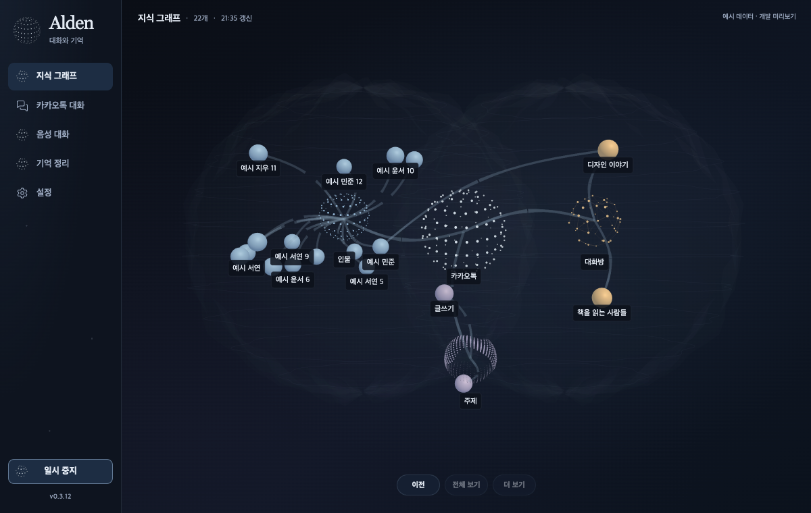

# Alden 0.3.12의 동적 기억 그래프

확인된 관계가 곡선 다리로 성장·수축하고, 강도 변화에 따라 노드 배치가 재조정된다. 선택한 노드로 빠르게 이동하며 이전 탐색 위치를 복원한다. 은은한 흐름과 작은 노드 움직임은 화면에 보이는 동안 계속된다. 상단은 `지식 그래프 · 항목 수 · 갱신 시각` 한 줄이다. 모델 추론이나 학습 상태는 실제 신호로만 표시한다.

## 연구 근거와 적용 범위

- Trachtenberg 등, 2002, [Long-term in vivo imaging](https://www.mcgill.ca/brianchenlab/files/brianchenlab/14-trachtenberg-nature-2002.pdf): 공개된 원논문에서 구조의 안정성과 시냅스 형성·제거를 구분한다. 화면에는 안정적인 노드 ID를 유지하면서 확인된 관계가 생성·철회될 때 다리가 성장·수축하도록 적용한다.
- Matsuzaki 등, 2004, [Structural basis of long-term potentiation](https://www.nature.com/articles/nature02617): 출판사 초록에서 자극된 spine의 선택적 크기 변화와 수용체 전류 증가가 연결된다. 관계 강도의 변화가 다리 폭과 국소 형태에 반영되도록 디자인에 적용한다. 본문의 유료 부분을 읽었다고 주장하지 않는다.
- Turrigiano 등, 1998, [Activity-dependent scaling](https://www.nature.com/articles/36103): 출판사 초록에서 총 입력 강도의 안정화와 비례적 조절을 다룬다. 고차수 노드가 화면 전체를 끌어당기지 않도록 힘을 차수로 정규화하는 디자인의 근거로 사용한다.
- Holtmaat·Svoboda 2009의 출판사 본문은 접근 오류였고 검색 초록만 확인했다. 이 리뷰를 원논문 검증으로 대체하지 않는다.

이 적용은 확인된 지식 관계의 시각적 모델이다. 생물학적 뉴런·actin·NMDA 반응의 재현이나 제품 모델의 학습 성공을 뜻하지 않는다. 관계의 존재·출처·강도는 원래 데이터가 결정하며, 공간적 근접성만으로 관계를 만들지 않는다.

## 수학과 제한

노드는 정규화 질량 m=1+importance/100∈[1,2]의 물체로 표현한다. 카카오톡 뿌리 노드는 고정한다. 원래 배치로 돌아가는 anchor 힘, 확인된 관계의 spring 힘과 완화된 반발력을 사용한다. 표시 강도 s=w/(1+w)이며 생물학적 확률이 아니다. spring 계수는 14(0.25+0.75s)/√(degree_i degree_j), rest length는 max(0.24, 기존 배치 거리)×(0.90−0.22s)다. 질량과 좌표는 UI 단위로, kg·m 단위의 생물 물리가 아니다.

분할 시간 h에 대해 v←exp(−11h)(v+hF/m), x←x+hv를 사용한다. 정상 프레임은 1/120초 기준이며 느린 프레임도 최대 8개 분할로 같은 elapsed time을 처리한다. 0.25초 이상 구간은 renderer의 frame horizon과 맞춰 제한한다. 위치는 ellipsoid 안으로 투영하고, 접촉 반력과 투영 후 속도를 기준으로 수렴을 판단한다. NaN/Infinity는 전파되지 않도록 제한한다.

활성 노드 24개·시냅스 묶음 144개, 배열은 고정 크기다. 원래 triple과 evidence를 보존하면서 그림의 중복 다리만 묶는다. 철회한 노드·관계와 기한이 지난 관계는 활성 표시에서 제외한다. GPU 다리는 하나의 persistent instanced ribbon batch를 사용한다. 폐기 중인 다리는 상호작용 대상이 아니다. 새 geometry를 프레임마다 만들지 않는다.

다리 전이는 α=1−exp(−Δt/0.16), 카메라 이동은 α=1−exp(−12Δt)다. 카메라 오차의 이론적 95% 감소 시간은 ln(20)/12≈0.250초로, 실제 클릭 지연 측정과 구분한다. 보이는 화면의 노드 변위 상한은 축별 0.035 UI 단위, 다리의 표현 흐름은 정규화 길이 기준 0.32/s다. 이는 학습·신경 발화 지표가 아니다. 선택한 노드와 뿌리는 움직임에서 제외한다.

배치가 수렴하면 물리 계산은 멈추지만, 가시 상태의 표현은 30fps 상한으로 계속된다. 숨김·닫힘·잠김은 루프와 갱신 타이머를 중지한다. 동작 줄이기와 비상 중지에서는 정적인 프레임을 사용한다. 변경 감지는 기존 Bridge가 고정된 `knowledge/osk/sync.json`의 파일 정보만 읽는 1초 probe이며, 별도 Python 프로세스를 실행하지 않는다. 변경 시 전체 그래프를 읽고, 15초 fallback으로 복구한다. 이 간격은 신규 대화의 전체 색인 지연 측정이 아니다.

## 검증 상태

UI 250개·desktop Rust 96개 검사와 TypeScript/Vite build·Clippy를 통과했다. 물리 시간 일치, 관계 강도에 따른 수축, 충돌/경계 수렴, 비정상 좌표 제한, 철회/기한 제외, 다리 성장/수축, geometry 소유권, metadata 원자적 파일 교체·symlink 거부, 숨김 epoch·실패 복구와 프레임 위상 회귀를 포함한다.

정적 검토에서 경계 잔류력·NaN 전파·시간 손실·빈 진단 잔류를 수정했다. 실제 렌더에서 30fps 기준의 시간 반올림이 주기적으로 세 번째 화면 refresh까지 기다리게 하는 문제를 발견해 위상을 유지하도록 고쳤다. 네이티브 탐색 검사에서 물리 위치 변화가 전체 보기의 카메라 목표를 바꾸던 문제도 발견해 안정적인 anchor 기준으로 복원을 수정했다. 이전 source hash의 검토를 현재 판본의 성공으로 대체하지 않는다.

| 같은 예시의 관측 | 수정 전 | 수정 후 |
|---|---:|---:|
| 5초간 렌더 수 | 115 | 151 |
| 초당 렌더 | 22.99fps | 30.17fps |
| 프레임 간격 p50 | 49.5ms | 33.3ms |
| 프레임 간격 p95 | 50.1ms | 35.2ms |
| Draw calls / geometry | 30 / 33 | 30 / 33 |

1200×760, 동일 장치·합성 22노드/22관계, 변형별 5초 표본 1회다. 초당 렌더 증가는 **31.22%**, 간격 p95 감소는 **29.74%**다. 작은 표본이며 간격은 CPU/GPU 렌더 시간이나 배터리 소모가 아니다. p95 35.2ms는 30fps의 33.33ms 간격보다 약 1.87ms 길다. 앱 전체 성능이나 세계 순위를 증명하지 않는다. [원시 관측과 계산](alden-neural-plasticity-20261003/cadence-comparison.json).

표현이 살아 있는 상태에서도 물리 계산은 수렴 후 정지했다. 예시에서 물리/다리 배열은 5,136+13,824=18,960바이트다. 앱 전체 RAM이나 GPU 복사본까지 합한 수치가 아니다. 페이지를 떠난 뒤 2초간 추가 렌더 0회, 동작 줄이기 3초간 0회, 예시 환경의 일시 중지 1.5초간 0회를 확인했다. 브라우저 640×680/DPR2에서는 가로 넘침 없이 20px 헤더 한 줄을 유지했다. 실제 Retina 하드웨어 검증과 구분한다.

별도 설치본 검사 창에서는 기본 1200×728·최소 640×648의 다섯 페이지, 출처 조회와 탐색 복원을 확인했다. 페이지 전환 첫 프레임은 10회 표본에서 p95/최대 13ms였다. 합성 process-local display-sleep/session-inactive 알림 후 추가 렌더는 0회였다. 물리 화면 잠금·사람의 음성·primary 메뉴바 입력은 이 검사에 포함되지 않는다.

로컬 0.3.12는 build/설치 파일 37개를 SHA-256으로 대조하고 deep/strict 서명 검사를 통과했다. 서명은 ad-hoc이며 공개 Developer ID 공증은 아니다. 기존 설정·등록·stable CLI의 내용/inode/수정 시각과 실행 중인 다섯 서비스가 보존됐다. 정확한 원격 코드·CI·릴리즈 상태는 PR과 패키지 manifest에서 확인한다. 실제 Dot 호출, 자연 음성, 공개 공증과 기존 운영 worker 전환 등 전체 목표의 남은 검증은 계속 별도로 관리한다.

[실제 구현 순서도](alden-neural-plasticity-20261003.sequence.html)는 Archify showcase 9/9·composition 오류/경고 0, 네 크기의 자동 브라우저 검사 통과, 두 테마의 이미지 판독을 확인했다. Viewer의 고정 제어 UI는 영어이며 본문은 한국어다.
