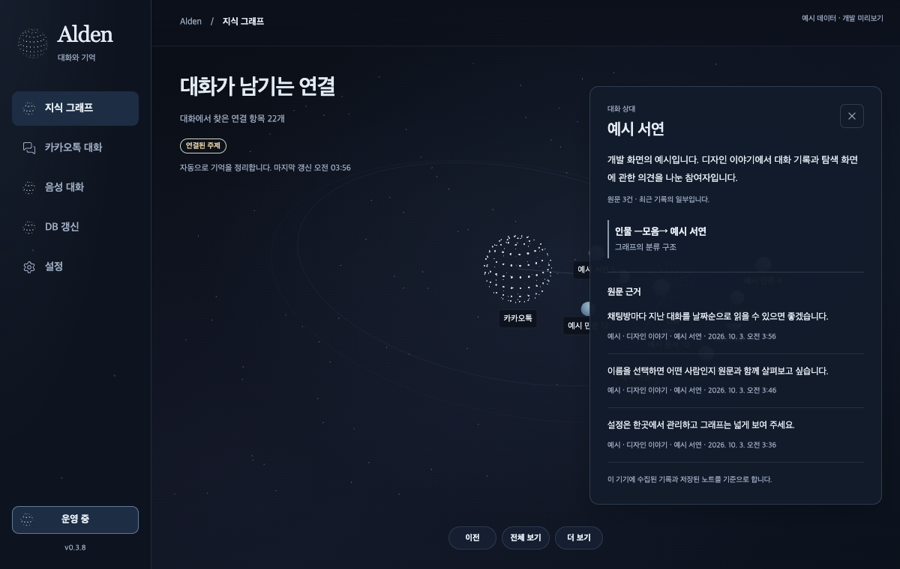

# Alden 0.3.9 — 오브와 근거가 있는 노드 설명

공식 [Thinking Orbs](https://libraries.dev/orbs)의 0.3.2 엔진을 실제 상태에 연결했습니다. 주요 지식 노드·선택 항목·사이드바·메뉴바가 은빛 점 구체를 공유하며, 대기·숨김·일시 중지·모션 감소에서는 정지합니다. React 없는 engine 경로와 MIT 고지를 사용합니다.

노드 카드는 유형·전체 저장 설명·연결 관계·원문을 분리합니다. 원문 최대 6건에는 방·작성자·날짜·원래 발신 구분이 남습니다. 계정·인물·방이 다른 자료를 제외하며, 원문을 확인하지 못하면 그렇게 표시합니다. 저장된 노트와 분류 구조는 대화 근거와 구별합니다.

소스 브라우저 예시 데이터: 기본 1200×760·최소 640×680·확장 1600×1000·가상 2x·팝업 560×420을 확인했습니다. 버전은 사이드바 하단 중앙에서 0.5px 이내였습니다. 같은 검색 화면의 1초 표본 3회에서 반복 라벨 변경 138→0, 대기와 합성 숨김의 렌더 호출 0을 관측했습니다. 전체 CPU·GPU·배터리 감소율을 뜻하지 않습니다.

네이티브 검사기의 과거 연속 렌더 가정을 수정했습니다. 실제 설정 WKWebView는 첫 1프레임 후 정지했고 기본·최소 탐색 복원이 통과했습니다. 별도 팝업은 10회×350ms 숨김 추가 프레임 0, 중단 관측 상한 median 11.2595ms/max 21.019708ms였습니다. 합성 가시성 알림이며 실제 잠금·상시 프로세스 조작과 구별합니다. 검사기는 고정된 persisted graph를 읽으며 기타 설정과 GraphRAG 원문 요청을 실행하지 않습니다. 실제 설치본의 OSK/corpus helper는 인물·방 각각 6개 출처를 보존했습니다.

소스 95e8482be841a339de1e0a19ebd87095ef0efd36, UI 231·Rust 94·Python 1149/28skip·Clippy/build 통과. 설치본 35개 경로와 ad-hoc deep/strict 서명을 대조했고 설정·등록·stable CLI·27B/E5 프로세스를 보존했습니다. [범위별 근거](alden-orbs-20261003.json)와 [Archify 수명주기](alden-three-render-lifecycle.html)를 함께 제공합니다. 다이어그램 작성 내용은 한국어, 고정 Viewer UI는 영어입니다.

상시 앱 GUI 접근은 도구 시간 초과로 미확인입니다. 실제 카카오 원본 최신화의 앱 데이터 접근 승인, 사람의 웨이크·마이크·에코·스피커·물리 중단/Retina, Developer ID/공증과 프로덕션 전환 게이트는 유지합니다. 전체 목표는 아직 진행 중입니다. [0.3.9 릴리즈 후보 초안](https://github.com/twoimo/openkakao-bot/releases/tag/untagged-d07220ab2b62bc8a89e9)은 6개 파일을 재다운로드해 SHA-256·원격 digest·크기를 대조했으며 ZIP 35경로와 태그의 소스 커밋이 일치합니다.
