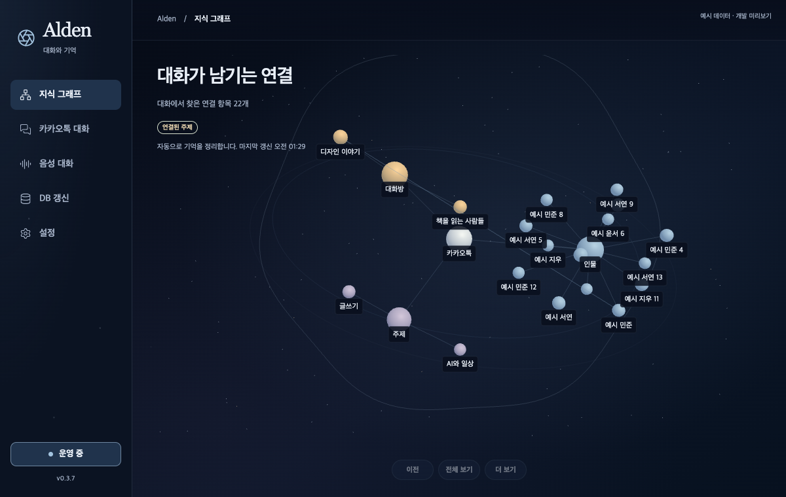

# 실제 재생 PCM과 그래프 — 0.3.7

0.3.6의 음성 상태에는 마이크 RMS만 있어 TTS 출력을 표현할 수 없었다. 0.3.7은 기존 AVAudioPlayerNode의 재생 티켓과 커서에 출력 PCM을 연결한다. 입력은 `user_listen`, 출력은 `speaking`에서 각각 읽는다. 준비 상태의 오래된 마이크 값으로 재생 진폭을 대신하지 않는다.

PCM은 기존 재생 경로에서 [-1,1]로 제한한 샘플이다. 480프레임/24kHz, 즉 **20ms**마다 RMS를 계산해 최대 6,000개의 Float(24KB)에 보관한다. 실제 playerTime의 완료 구간만 조회하며, 아직 그리지 않은 PCM과 이전 티켓은 사용하지 않는다. stop/close/교체·기기 실패·200ms 이상 오래된 렌더 시각에서는 0이다. ABI2를 명시하고 이전 ABI는 오디오·권한 요청 전에 거부한다. 가중치·화자·합성 알고리즘은 변경하지 않는다.

[Apple의 player timeline](https://developer.apple.com/documentation/avfaudio/avaudioplayernode)과 [시간 변환](https://developer.apple.com/documentation/avfaudio/avaudioplayernode/playertime%28fornodetime%3A%29)을 기준으로 실제 SDK를 실행했다. 오프라인 커서는 완료 구간의 끝을 가리켰다. 다음 구간을 읽으면 첫 무음에 미래 소리가 표시되므로 완료 구간을 선택했다. 시작 직후 sample/host time이 모두 유효하지 않은 값을 변환하면 **NSException·exit134**가 발생했다. 변환 전 유효성 검사로 수정했고, 동일 회귀를 통과했다. 이는 과거 recursive_mutex 오류의 원인이나 해결로 보고하지 않는다.

기존 Python 음성 프로세스가 상태를 게시할 때만 네이티브 커서를 조회한다(최대 10Hz). 마이크 20ms 패킷마다 조회하지 않는다. 출력 측정 실패나 취소된 턴은 0이다. 새 Tauri 명령은 앱의 작은 상태/중단 파일만 읽으며 Python·모델 호출을 만들지 않는다. 표시 중 조회 주기는 음성 상태가 있으면 100ms, 없으면 750ms다. 기존 전체 상태 2.5초 조회와 분리했고 숨김·종료에서는 중단한다. 재생 중 입력 RMS가 출력 값으로 섞이지 않으며 비상 중단 파일이 잠기거나 유효하지 않아도 진폭을 차단한다. 기존 wake 검증 제한은 유지한다.

실제 AVAudioEngine **오프라인 DSP/커서**에서 무음→0.25→0.5 신호 7구간, 기존 실제 Qwen TTS WAV2개의 **144구간**을 비교했다. 완료 구간의 출력 PCM RMS 불일치 **0**, 시작 전·stop 뒤·새 버퍼 렌더 전 진폭 **0**이다. 오프라인 재생은 스피커나 마이크를 사용하지 않는다. 여기서 측정하는 값은 믹서·기기 볼륨 전 PCM이며 실제 청취 크기를 증명하지 않는다.

UI224, Rust92, Clippy·빌드, 프로젝트 Python3.11.9 필수 **1,148검사/28skip**가 통과했다. NumPy가 있는 고정 음성 환경의 소유권·취소·측정 게시 검사16개도 통과했다. 최초 기본 Python의 DPO7개 오류는 `mlx_lm` 누락이었으며, 라이브 환경을 변경하지 않고 CI와 같은 Python3.11 환경으로 확인했다. 관련 없는 DPO 소스나 검사 조건은 변경하지 않았다.

실제 Chrome/M5 Max Metal에서 기존 5크기·중앙 버전·캔버스 선택·resize·메뉴 전환을 확인했다. 합성 native IPC의 입력0.16→출력0.25(입력0.95와 구분)→취소→오래된 상태→숨김/복원을 통과했다. 안정된 1초×3 추가 렌더 **0/0/0**, 숨김1초 프레임·음성 조회 **0/0**이다. 조회 주기 변경은 설정값이며 25배 빠른 체감 응답·CPU/전력 절감으로 주장하지 않는다. 물리 primary/Retina와 자연 마이크·wake·에코·스피커·물리 중단·발화 종료부터 재생 지연은 여전히 별도 검증이 필요하다.

[정제된 근거](alden-playback-amplitude-20261003.json), [렌더 수명주기](alden-three-render-lifecycle.html), [음성 턴·취소](alden-voice-cancellation.html)를 제공한다. 화면은 예시 데이터의 개발 미리보기이며 primary 설치 화면이 아니다. 두 도식은 showcase9/9·오류/경고0, 각각 실제 브라우저4크기·두 테마 이미지 검토를 통과했다. 도식의 작성 내용은 한국어이고 고정 Viewer UI는 영어다.

전달: 런타임 소스 `42182f3e3fe1404ed7774c5f7e6292c6469310e0`의 [CI](https://github.com/twoimo/openkakao-bot/actions/runs/37035907184)는 **4/4 성공**이다. 설치된 Alden0.3.7의 **35개 경로·deep/strict ad-hoc 서명·실제 ABI2 consumer 초기화**를 확인했다. 초기화는 오디오 handle·권한 요청·네트워크 없이 종료했고 RMS0이었다. config·enrollment·stable CLI와 기존27B/E5 PID·시작 시각·명령을 보존했으며 두 정확한 모델의 loaded/ready catalog를 다시 확인했다. [초안 릴리즈](https://github.com/twoimo/openkakao-bot/releases/tag/untagged-2811b9b39f0c40edc71e)의 **6개 파일**을 다시 다운로드해 바이트·SHA256·GitHub digest를 대조했고 ZIP 내부35경로와 태그 소스도 일치한다. [설치·릴리즈 receipt](alden-playback-amplitude-install-20261003.json)는 이 범위를 구분한다. 원본 카카오 접근 승인·공개 서명·승인된 생산 전환과 전체11항목 완료를 대신하지 않는다.
