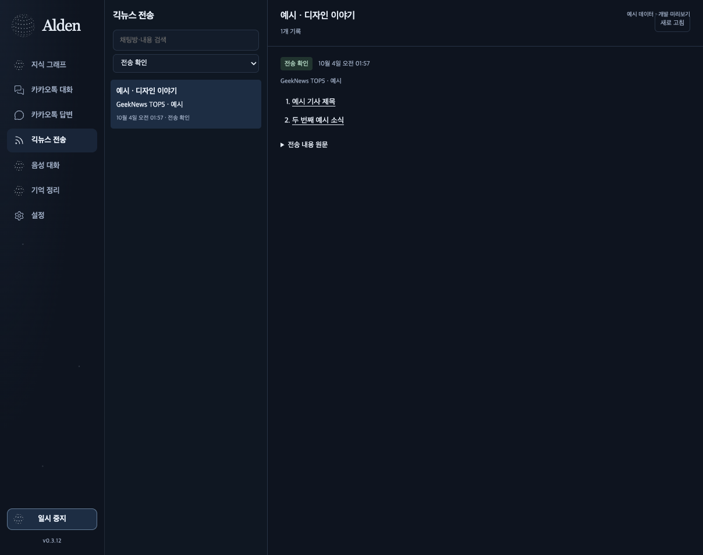

# Alden Raw sources and automatic history — 2026-10-04

Alden 0.3.13 has separate **카카오톡 답변** and **긱뉴스 전송** pages. Each page reads existing receipts and queues, joins generation and delivery by event identity, and shows the room, time, original input/context, response or articles, and result. Confirmed sends are the initial filter; waiting, unknown, cancelled, failed and skipped events remain searchable. Keyset pagination keeps identical timestamps and large integer IDs distinct. No history read starts a worker, sends or retries a message, or changes automation enrollment.

The history reader scanned the actual retained records (3,069 reply events, 527 news events). Five same-process reads per kind measured median 199.98 ms / 208.29 ms respectively, with maximum 337.37 / 222.55 ms. These are local backend read durations, not UI response p95 or a before/after speed gain. Older ledger bodies were already limited to 500 characters; the reader labels those previews and preserves uncertainty instead of inventing a confirmed send.

## Raw rebuild and OSK

The implementation uses the actual pinned [OSK repository](https://github.com/lpaiu-cs/osk-system), v4.1.2 commit `9bbf08febc5a1fb2af068006735ed79cbdb71178`, with the existing documented adjacency patch. The full published corpus was captured consistently with SQLite Online Backup. This is the already published Alden corpus; the original encrypted Kakao database was not newly accessed in this rebuild.

All 2,050,483 captured rows were exported as immutable private `_sources` records, retaining full original SQL fields, identities and `peer_history`, `outgoing_unclassified`, or `system_history` roles. External Kakao messages are not fabricated OSK user/agent `_raw` rounds. Raw files, corpus snapshots, message bodies, room titles and source IDs stay outside this public repository and release assets.

The graph was rebuilt from original rows with normalized keyword classification of incoming text, exact scoped IDs, participant metadata and same-message co-mentions. Topic counts describe dictionary matches, not human-approved semantic truth or causation. Ordinary notes are written through the real OSK `create_node` / `update_node` APIs with genuine `derived-from` coordinates into `_sources`. The SDK owns IDs and author fields; human edits and approval files are preserved. Prior derived graph/vault state was privately backed up before application.

The applied graph has **115 active managed notes, 115 valid contracts, 115 Raw source connections**, pending **0**, conflicts **0**. All **111 shared existing OSK IDs** were retained. Referenced new/corrected source versions append immutable files; refreshes do not repeat the full two-million-row export. The initial full archive is an as-of snapshot; later referenced records are versioned from the current published corpus.

## Quality and unnamed rooms

Duplicate identity uses `(account, room_id, log_id)`, never equal display names or repeated text under distinct IDs. The captured corpus had **0 duplicate identity groups and 0 conflicting identity groups**. Conflicting source IDs are archived but withheld from learned notes. NFKC and whitespace cleanup changed **6 room display labels** while preserving all Raw bytes and numeric identities.

Length outliers are retained and indexed as review candidates:

`z = 0.67448975 × |log(1 + character_length) − median| / max(MAD, 0.01)`

At `z > 6`, **2,298 rows** (0.1121% of the captured corpus) were flagged in a private derived quality index. Median log-length was 2.302585, MAD 0.510826; **0 Raw rows were deleted**. Long messages are not classified as false solely from this statistic.

There were **213 unnamed rooms**. **89** received display aliases grounded in recorded participants; other unresolved rooms retain distinct ID labels. This does not rename Kakao rooms or merge people/accounts with identical names. The conversation view and room search use these account-scoped display aliases for otherwise unnamed records. User-supplied room names stay unchanged.

## UI and verification

The redundant sidebar activity caption was removed. The automation room field is now a keyboard-accessible searchable combobox with exact IDs and disambiguated equal names. The existing local model controls now explicitly show Qwen3.8 Flash Next and Qwen3.8 27B; readiness, memory admission and persisted selection guards remain in place. The development preview uses isolated fixture model commands, while native controls retain the real local command path.

UI suite: **256/256** before final small history/list changes; affected final UI cases **8/8**. Python Raw/SDK/history/snapshot checks **43/43**, with the additional alias/history checks **13/13**. Desktop Rust **96/96**, TypeScript/Vite and clippy pass. Installed 0.3.13 matches the built bundle's **40 files by SHA-256** and passes deep/strict ad-hoc signature verification. Three configuration/CLI baselines and five existing model/voice/automation process identities stayed unchanged.

Installed native workspace audit: **7/7 pages at default size and 7/7 at minimum size**, **0 page errors**, **0 horizontal overflows**. Across 14 heterogeneous navigation events, observed first-frame p95/max was **16 ms**. Two process-local synthetic hidden notifications produced **0 subsequent renders over 350 ms**, with observation upper bounds **17.49 / 15.99 ms**. These are owned-window observations, not physical primary/OS-lock timing.

The narrow in-app browser produced inaccurate screenshots after viewport override; only its DOM overflow check is available for that case. Temporary overrides were reset. Native workspace evidence uses the installed app's owned read-only WKWebView audit; it does not attest physical primary HID, actual OS screen lock, Retina, microphone, or production signing.

The broader goal remains active. Developer ID/notary setup, physical voice and primary interaction checks, Alden-dot attestation and unmet model/media latency goals are separate from this delivered Raw/history update. The local bundle is ad-hoc signed, not notarized.
