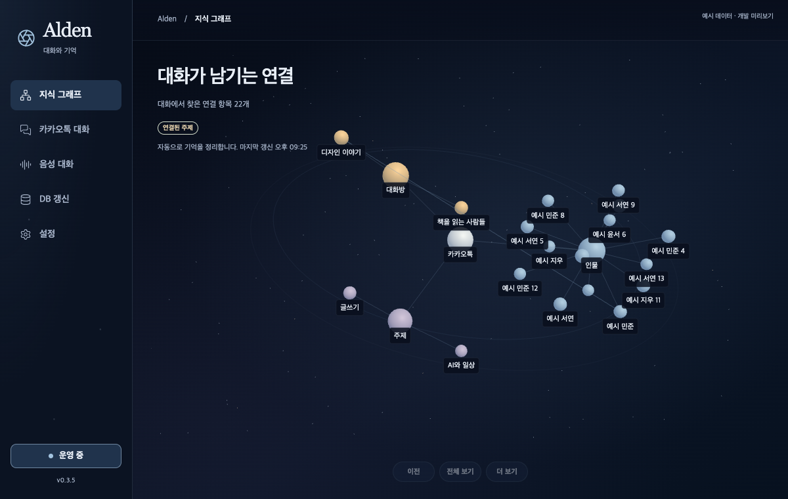

# Alden 0.3.5: 지식의 우주와 사이드바

지식 그래프와 사이드바, 메뉴바 팝업에 같은 밤하늘 팔레트를 적용했다. 실제 관계는 별자리처럼 잇고 인물·방·주제의 색을 구분한다. 원래 메뉴, 방 자동화 CRUD, 대화·음성 기록, DB 갱신, 운영 버튼 하나와 사이드바 아래 중앙 버전은 유지한다.

## 구현과 제한

배경은 고정된 1,536개 점 한 묶음과 두 개 궤도선이다. 지식 데이터·키보드 탐색·클릭 대상에 들어가지 않는다. 전경은 기존 24개 노드 예산을 사용하고, 인물은 소수 해시의 나머지로 위치가 뭉치던 방식을 고르게 펼치는 배치로 바꿨다. 노드 ID와 관계는 그대로다. 배경 점·선·노드의 GPU 자원은 창의 소유권에 따라 한 번만 해제한다.

정지한 화면은 렌더 루프를 멈춘다. 데이터·크기·부하·실제 조작이 바뀌면 필요한 프레임을 다시 요청한다. 카메라 이동은 기존 제한된 루프를 쓰며, 화면 전환·숨김은 대기 중인 프레임을 취소한다. 음성·추론 등 다른 GPU 작업의 사용량이 0이라는 뜻은 아니다.

실제 마우스 검증에서 구형 노드의 삼각형 경계 클릭 실패를 발견했다. Three.js 0.180.0에서 카메라 y=0일 때 선택되던 같은 구가 y≈3.18e-16이면 선택되지 않는 조건을 별도 Node 계산으로 재현했다. 구 표면을 직접 계산해 선택하도록 수정했고, 레이어·거리·앞쪽 노드 및 최신 위치를 검증한다. 보이지 않는 배경 별을 대신 선택하지 않는다.

## 브라우저 증거

[기계 판독 기록](alden-universe-browser-20261002.json)은 설치된 Playwright 1.63.0과 Google Chrome으로 제품 코드의 명시적인 개발 예시 데이터를 렌더링했다. GPU 보고값은 Apple M5 Max의 ANGLE Metal이다. 다른 브라우저 프로필이나 모델 프로세스를 재사용·변경하지 않았다.

| 조건 | 크기 / 배율 | 결과 |
| --- | --- | --- |
| 기본 | 1200×760 / 1× | 콘솔·GL 오류와 넘침 0, 중앙 버전 |
| 최소 | 640×680 / 1× | 콘솔·GL 오류와 넘침 0, 중앙 버전 |
| 확장 | 1600×1000 / 1×, 어두운 OS 테마 | 콘솔·GL 오류와 넘침 0 |
| 배율 | 1200×760 / 2×, 어두운 OS 테마 | 콘솔·GL 오류와 넘침 0 |
| 팝업 | 560×420 / 1× | 콘솔·GL 오류와 넘침 0 |

마우스로 실제 노드를 선택하고 카메라 이동, 다른 페이지 전환 후 프레임 0, 그래프 복원, 전체 보기, 크기 변경 후 새 프레임을 확인했다. 2배율은 브라우저 에뮬레이션이며 실제 macOS Retina 증거와 구분한다. 겹치는 표식은 기존 충돌 제한으로 숨기고 키보드 목록과 상세 이름을 유지한다.

동일 장치·예시 데이터·배경에서 정지 렌더 정책 전후를 1초씩 3회 비교했다. 기존 프레임 호출은 14/13/14회, 변경 후는 0/0/0회였다. 호출 수의 감소이며 소비 전력·GPU 시간·앱 전체 메모리 감소율은 측정하지 않았다. UI 검사 214개, 네이티브 91개와 clippy, 소스 빌드를 통과했다.

기본·최소·팝업·선택 상세 화면을 별도로 시각 검토했다. [창 수명주기](alden-three-render-lifecycle.html)는 정지 대기와 새 프레임 요청을 실제 구현에 맞춰 갱신했다. 작성한 설명은 한국어, 고정 뷰어 UI는 영어다.

설치와 원격 CI·릴리스 대조는 별도 전달 기록으로 확인한다. 원본 앱 데이터 접근 승인, 사람의 마이크·wake·재생·물리 단축키, 실제 주 프로세스 화면·Retina, Apple 서명·공증과 프로덕션 전환은 아직 미완료다.
