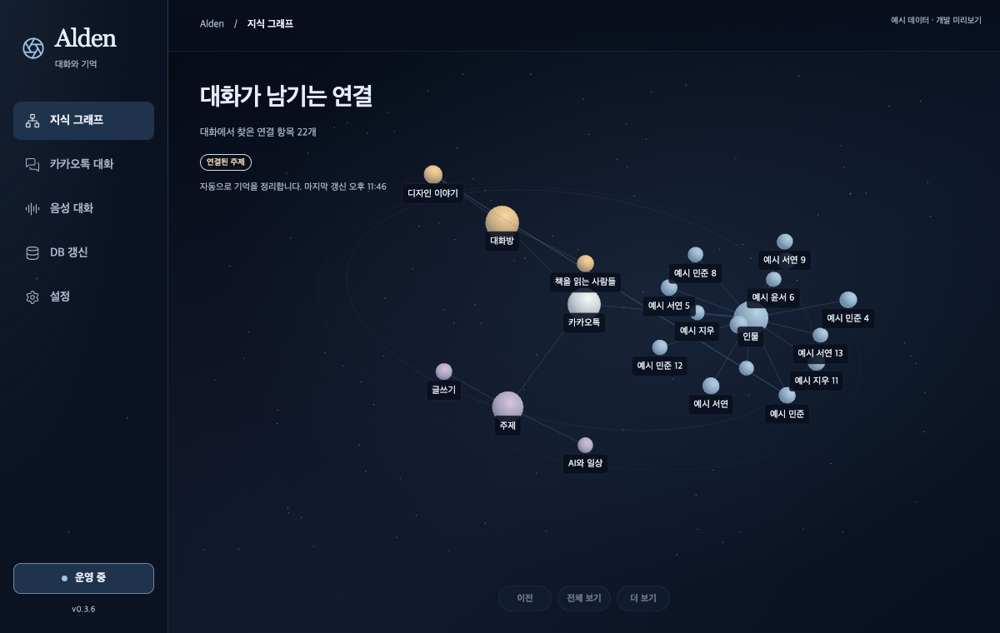

# 우주 그래프의 입력 진폭 — 0.3.6

새 지식 그래프가 전달받은 마이크 RMS를 무시하던 연결을 보완했다. 설정과 메뉴바 그래프는 최근 입력 크기를 한 개의 얇은 궤도선에 표시한다. 사이드바의 밤하늘 팔레트, 메뉴, 운영 버튼과 하단 중앙 버전을 유지한다. 업무 부하로 음성을 꾸미거나 재생 중 마이크 값을 출력 진폭으로 표시하지 않는다.

입력은 [0,1] RMS, 표시값은 τ=0.12초의 시간 기반 평활화다. geometry·128점 Float32Array·material을 한 번 할당한다. 반경 변화 ≤0.12, opacity ≤0.36, 합성 주파수·자동 위상 이동은 없다. 카메라와 진폭이 안정되면 양수 입력에서도 루프가 멈춘다. 조용할 때 궤도선이 숨겨진다. [변수·단위·수명 계약](../../desktop/DESIGN.md)에 상세히 기록했다.

상태 조회는 기존 2.5초 poller를 재사용하고 그래프가 보일 때만 실행한다. 입력 상태·가용성·오류·3초 freshness를 함께 검사한다. 오래된 값, 오류·중단·완료·생성·재생 상태는 입력 진폭 0으로 처리한다. 숨김/잠금/종료는 polling과 RAF를 중단하고 envelope를 비운다. 이 표시는 저주기로 관측한 입력 envelope이며 실시간 음성 파형이나 출력 PCM 측정을 뜻하지 않는다.

UI **220개 검사**와 빌드가 통과했다. 실제 Chrome/Apple M5 Max Metal 렌더링에서 1200×760, 640×680, 1600×1000, emulated DPR2, 560×420의 오류·넘침·GL 오류는 모두 0이었다. 버전 중앙 오차는 0.5px였다. 실제 캔버스 선택·전체 보기·resize·메뉴 숨김/복원도 통과했다. 별도 합성 신호 0→0.25→speaking→stale→hidden→1에서 입력과 표시 진폭을 확인했다. 안정된 1초×3 구간 추가 프레임 **0/0/0**, 숨김 3초 추가 프레임·조회 **0/0**이다. CPU·전력 감소율은 측정하지 않았다.

아래는 직접 검토한 **예시 데이터의 개발 화면**이다. 현재 primary 앱의 실제 화면이나 물리 Retina로 보고하지 않는다. primary CUA timeout, 사람의 마이크·wake·스피커 검증과 원본 DB 접근 승인, 공개 서명·생산 전환은 별도 미완료다.

2026-10-03 전달: 소스 `0976f925a8fef3bf2c3755de9b738aa3de2c42c7`의 [원격 CI](https://github.com/twoimo/openkakao-bot/actions/runs/37023582956)는 **4/4 성공**이다. 설치된 Alden 0.3.6은 **35개 경로 일치·deep/strict ad-hoc 서명 검증**을 마쳤다. config·enrollment·stable CLI와 기존 27B/E5 PID·시작 시각·명령은 같고, 두 모델의 loaded/ready catalog를 다시 확인했다. 음성 어댑터도 기존 0.3.5 측정본과 같은 hash다. [초안 릴리즈](https://github.com/twoimo/openkakao-bot/releases/tag/untagged-7911b0b499e680e01fbd)의 **6개 산출물**을 다운로드하여 원본 SHA256·GitHub digest·길이를 대조했고, 다운로드 앱 내부 35경로와 태그의 소스 SHA도 일치한다. [전달 receipt](alden-voice-envelope-install-20261003.json)에 설치·모델·태그·각 파일 근거를 구분한다. 이 전달은 공개 공증이나 생산 전환 완료를 뜻하지 않는다.

[정제된 화면·신호 근거](alden-voice-envelope-20261002.json)와 [Archify 렌더 수명주기](alden-three-render-lifecycle.html)를 제공한다. 도식은 showcase 9/9·오류/경고 0, 실제 브라우저 4크기·이미지 검토 통과다. 작성 내용은 한국어이며 고정 Viewer UI와 html lang은 영어다.
